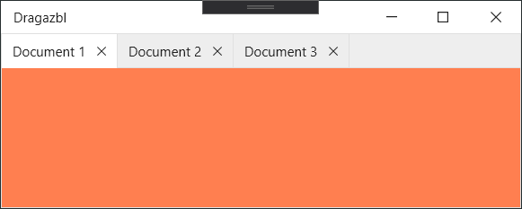

# HandyDragablz
A Mash Up of [HandyControl](https://github.com/HandyOrg/HandyControl) and [Dragablz](https://github.com/ButchersBoy/Dragablz)



### Usage

1. Add reference to Nuget packages [HandyControl](https://www.nuget.org/packages/HandyControl) and [Dragablz](https://www.nuget.org/packages/HIT.Dragablz) (in this project I've used this [port](https://github.com/highway-it/Dragablz) to .NET Core)

2. Copy ResourceDictionary file `TabablzControl.xaml` to your project

3. Add the following to `App.xaml`
```xaml
<Application.Resources>
    <ResourceDictionary>
        <ResourceDictionary.MergedDictionaries>
            <ResourceDictionary Source="pack://application:,,,/HandyControl;component/Themes/SkinDefault.xaml"/>
            <ResourceDictionary Source="pack://application:,,,/HandyControl;component/Themes/Theme.xaml"/>
            <ResourceDictionary Source="TabablzControl.xaml"/>
        </ResourceDictionary.MergedDictionaries>
    </ResourceDictionary>
</Application.Resources>
```
4. Add the following to `MainWindows.xaml`
```xaml
    <dragablz:TabablzControl ItemsSource="{Binding Documents}" 
                             SelectedItem="{Binding Document}" 
                             Style="{StaticResource HandyTabablzStyle}" 
                             ShowDefaultCloseButton="True" >
        <dragablz:TabablzControl.HeaderItemTemplate>
            <DataTemplate DataType="{x:Type local:Document}">
                <TextBlock Text="{Binding Header}" />
            </DataTemplate>
        </dragablz:TabablzControl.HeaderItemTemplate>
        <dragablz:TabablzControl.ContentTemplate>
            <DataTemplate DataType="{x:Type local:Document}">
                <Border Background="{Binding Background}" />
            </DataTemplate>
        </dragablz:TabablzControl.ContentTemplate>
    </dragablz:TabablzControl>
```
