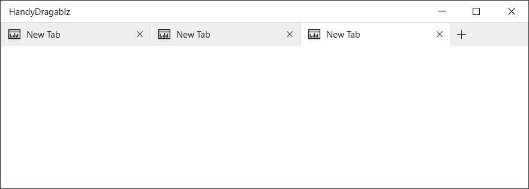

# EdgeDragablz
A Mash Up of [HandyControl](https://github.com/HandyOrg/HandyControl) and [Dragablz](https://github.com/ButchersBoy/Dragablz)



### Usage

1. Add reference to NuGet packages [HandyControl](https://www.nuget.org/packages/HandyControl) and [Dragablz](https://www.nuget.org/packages/HIT.Dragablz) (in this project I've used this [port](https://github.com/highway-it/Dragablz) to .NET Core)

2. Copy ResourceDictionary file `TabablzControl.xaml` to your project

3. Add the following to `App.xaml`
```xaml
<Application.Resources>
    <ResourceDictionary>
        <ResourceDictionary.MergedDictionaries>
            <ResourceDictionary Source="pack://application:,,,/HandyControl;component/Themes/SkinDefault.xaml"/>
            <ResourceDictionary Source="pack://application:,,,/HandyControl;component/Themes/Theme.xaml"/>
            <ResourceDictionary Source="Themes/Styles/TabablzControl.xaml"/>
        </ResourceDictionary.MergedDictionaries>
    </ResourceDictionary>
</Application.Resources>
```

### Databinding

4. Add the following to `MainWindow.xaml`
```xaml
    <dragablz:TabablzControl ItemsSource="{Binding Documents}" 
                             SelectedItem="{Binding Document}" 
                             Style="{StaticResource HandyTabablzStyle}" 
                             ShowDefaultCloseButton="True" >
        <dragablz:TabablzControl.HeaderItemTemplate>
            <DataTemplate DataType="{x:Type local:Document}">
                <TextBlock Text="{Binding Header}" />
            </DataTemplate>
        </dragablz:TabablzControl.HeaderItemTemplate>
        <dragablz:TabablzControl.ContentTemplate>
            <DataTemplate DataType="{x:Type local:Document}">
                <Border Background="{Binding Background}" />
            </DataTemplate>
        </dragablz:TabablzControl.ContentTemplate>
    </dragablz:TabablzControl>
```

### Prism

Usage with Prism is fairly more complex. Please refer to sample code to correctly implement `App.xaml.cs`, `MainWindowViewModel` and `RegionAdapter`.

4. Add the following to `MainWindow.xaml`
```xaml
<dragablz:TabablzControl x:Name="Tabs" prism:RegionManager.RegionName="{x:Static local:RegionHelper.RegionName}"
                            Style="{StaticResource TabablzEdgeStyle}" ShowDefaultCloseButton="True">
        
    <dragablz:TabablzControl.InterTabController>
        <dragablz:InterTabController InterTabClient="{Binding InterTabClient}"/>
    </dragablz:TabablzControl.InterTabController>
        
    <dragablz:TabablzControl.HeaderItemTemplate>
        <DataTemplate DataType="{x:Type vm:DocumentViewModel}">
            <Grid>
                <Grid.ContextMenu>
                    <ContextMenu>
                        <!--we'll be in a popup, so give dragablz a hint as to what tab header content needs closing -->
                        <MenuItem Command="{x:Static dragablz:TabablzControl.CloseItemCommand}"/>
                        <MenuItem Command="{x:Static dragablz:TabablzControl.CloseOtherItemsCommand}"/>
                    </ContextMenu>
                </Grid.ContextMenu>
                <TextBlock Text="{Binding DataContext.Header}" MaxWidth="100" TextTrimming="CharacterEllipsis" ToolTip="{Binding DataContext.Header}" />
            </Grid>
        </DataTemplate>
    </dragablz:TabablzControl.HeaderItemTemplate>
                
</dragablz:TabablzControl>
```

### Issues
De-registration of region is not happening correctly when tab is teared-off

### Next developments

1. Complete `DragablzItemsControl` style using `UniformGrid`
2. Inclusion of `TabablzControl` in `NonClientAreaContent` (possible?)
